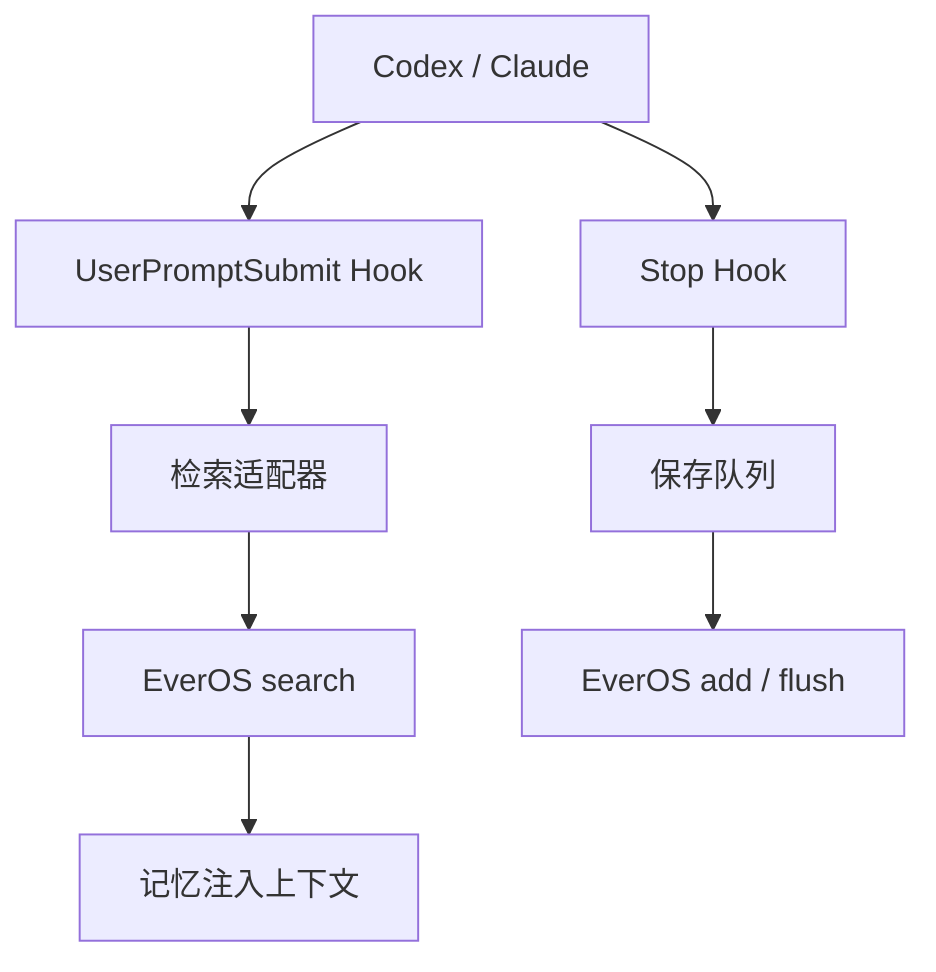

# EverOS 自托管记忆系统技术结论

**可以实现，技术可行性高，而且不需要 Raven。**

你缺的不是模型，也不是另一套记忆数据库，而是一层连接 Codex、Claude 和 EverOS 的"自动记忆插件"。



## 为什么确定能实现

| 环节        | 已验证能力                                   |
| --------- | --------------------------------------- |
| 提问前自动检索   | Codex、Claude 都有 `UserPromptSubmit` Hook |
| 自动注入记忆    | 两者都支持返回 `additionalContext`             |
| 回答后自动保存   | 两者都有 `Stop` Hook，并可取得最终回答               |
| 手动管理记忆    | 两者都支持本地 STDIO 或远程 HTTP MCP              |
| EverOS 写入 | `/api/v2/memory/add`                    |
| EverOS固化  | `/api/v2/memory/flush`                  |
| EverOS检索  | `/api/v2/memory/search`                 |

Codex 官方甚至把"自动总结聊天并生成持久记忆"列为 Hooks 的典型用途；`UserPromptSubmit` 输出可以直接成为模型的额外上下文。[Codex Hooks](https://learn.chatgpt.com/docs/hooks)

Claude Code 同样明确支持每轮提问前的 `UserPromptSubmit`、回答后的 `Stop`，以及通过 `additionalContext` 注入外部数据。[Claude Code Hooks](https://code.claude.com/docs/en/hooks)

EverOS 1.2.3 的三个接口契约已经足够完成全部记忆闭环。[EverOS 1.2.3 API](https://github.com/EverMind-AI/EverOS/blob/v1.2.3/docs/api.md)

## 最省成本的实现方式

不要从头开发，也不要直接安装 EverMe 云端版本。

更合适的是：**复用 EverMe 官方 Codex/Claude 插件的 Hook 结构，只替换它的网络客户端。**

把：

```text
/api/v1/mem/search
/api/v1/mem/agent-memory
/api/v1/mem/context
```

替换为你服务器的：

```text
/api/v2/memory/search
/api/v2/memory/add
/api/v2/memory/flush
```

官方插件已经实现了以下麻烦部分：

* Codex 和 Claude 生命周期适配
* 记忆注入格式
* 每轮去重
* 每五轮 Flush
* 会话状态计数
* 失败时自动降级，不阻断正常对话
* 敏感信息过滤
* Codex/Claude 插件安装结构

参考：[EverMe Codex 插件](https://github.com/EverMind-AI/EverMe/tree/main/plugins/everme)、[EverMe Claude 插件](https://github.com/EverMind-AI/EverMe/tree/main/plugins/claude-code)。

## 你的实际部署结构

如果 Codex、Claude 运行在 Windows：

* 服务器继续只运行 EverOS，保持 `127.0.0.1:8000`
* Windows 安装 Codex/Claude Hooks 和本地适配器
* 通过持久 SSH 隧道访问 EverOS
* 不开放公网端口

如果 Codex、Claude 也运行在服务器，则适配器直接访问 `127.0.0.1:8000`，更加简单。

EverOS 本身没有鉴权，官方也不建议直接暴露到不可信网络，因此继续使用 SSH 隧道是正确结构。[EverOS 安全边界](https://github.com/EverMind-AI/EverOS/blob/v1.2.3/SECURITY.md)

## 当前配置是否够用

目前的 `MiniMax-M3 + chat + 关键词检索`：

* 足够验证自动保存和自动召回闭环
* 不需要重新安装 vLLM
* 不需要 Raven
* 不需要 Rerank
* 不需要改变现有正式数据

但关键词检索只能匹配相同或相近词语。要实现"换一种说法仍能想起过去的知识"，后续需要增加 Embedding。

EverOS 支持任意 OpenAI 兼容的 Embedding 接口，所以可以选择：

* 国内 Embedding API
* 本地 vLLM Embedding 服务
* 其他 OpenAI 兼容服务

Embedding 提高的是**找得准不准**，Hooks 解决的是**会不会自动找**，这是两个独立问题。[EverOS 配置说明](https://github.com/EverMind-AI/EverOS/blob/v1.2.3/docs/configuration.md)

## 需要防止的四个问题

1. **重复写入**：用 `platform + session_id + turn_id` 做幂等键。
2. **记忆污染**：不要保存全部工具输出、密钥、日志和模型猜测。
3. **自我强化错误**：助手生成的结论不能自动升级成已确认事实。
4. **Hook 超时**：检索超过约 2–3 秒应直接放行；写入使用本地队列异步重试。

## 利益与成本归属

EverMind 开源了存储引擎，但官方现成插件接入自己的 Gateway：这样账号、认证、云端数据和持续收费入口仍掌握在平台手里。

自建适配器以后：

* 数据控制权归你
* 跨 Codex/Claude 的记忆归你
* 云端记忆费用可以取消
* 但插件升级、接口兼容和运维责任也转移给你

所以不是技术做不到，而是官方没有动力把"完全绕过其 Gateway 的本地成品"替你做好。

## 最终建议

**值得实施。先用关键词模式做隔离 POC，验证 Codex 保存、Claude 跨端召回；成功后再增加 Embedding。**

当前尚未完成的是你服务器上的实际插件实测，而不是技术可行性验证。